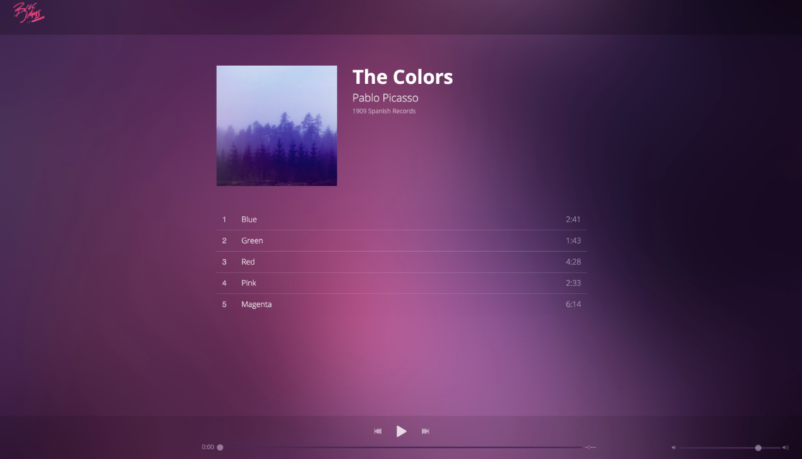

# bloc-jams-jquery
A starter project for Bloc's jQuery-driven music player app

### About the Project
The finished app is a fully functional music player. It will display album information, list the songs for an album, and include standard music controls for playing, pausing, skipping forward/backward, and adjusting the volume.

* [**Bloc Jams Site**](https://bloc-jamscc.netlify.com/)
